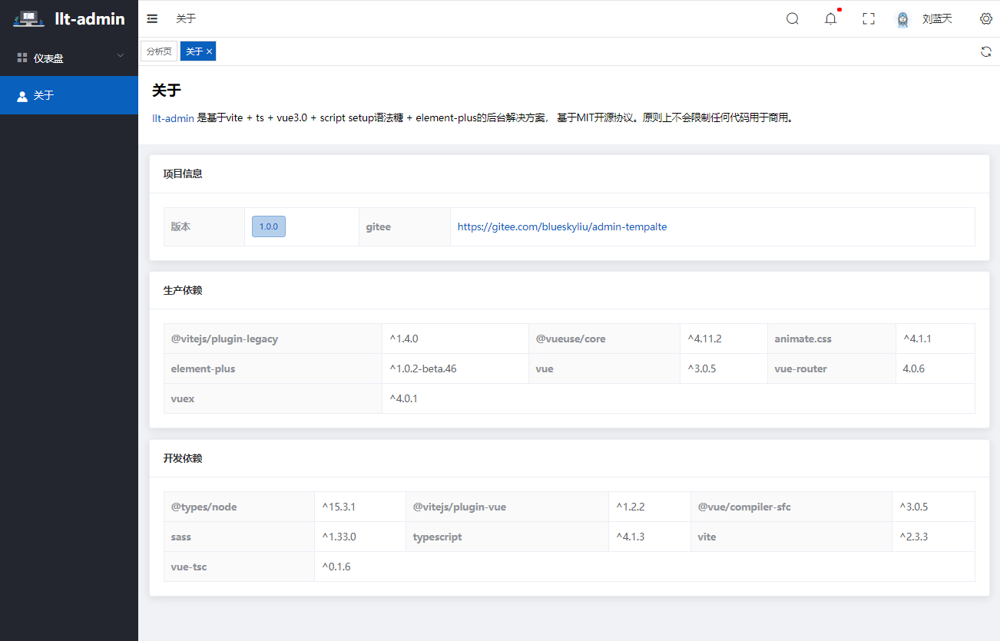

# 日志 
## 更新 添加 cesium 做3d地图
* 开发文档
https://cesium.com/learn/ion-sdk/ref-doc/Camera.html
```js
天地图：

imageryProvider: new Cesium.WebMapTileServiceImageryProvider({
    url: "http://t0.tianditu.com/img_w/wmts?service=wmts&request=GetTile&version=1.0.0&LAYER=img&tileMatrixSet=w&TileMatrix={TileMatrix}&TileRow={TileRow}&TileCol={TileCol}&style=default&format=tiles&tk=e378319b5250eff0fdd562f3aa190e62",
    layer: "img",
    style: "default",
    format: "tiles",
    tileMatrixSetID: "w",
    credit: new Cesium.Credit('天地图全球影像服务'),
    subdomains: ['t0', "t1", "t2", "t3", "t4", "t5", "t6", "t7"],
    maximumLevel: 18,
    show: true
})

高德地图：

imageryProvider : new Cesium.UrlTemplateImageryProvider({
    url: "http://webrd02.is.autonavi.com/appmaptile?lang=zh_cn&size=1&scale=1&style=8&x={x}&y={y}&z={z}",
})

ArcGIS切片地图：

imageryProvider : new Cesium.ArcGisMapServerImageryProvider({
    url : '//services.arcgisonline.com/ArcGIS/rest/services/World_Street_Map/MapServer'
})
```
```js
vite-plugin-compression vite 开启gzip插件
import viteCompression from 'vite-plugin-compression';
plugins: [
    viteCompression()
  ],

```
# 效果图 由于服务器维护无法提供在线地址
 
# 注意事项
* 一个项目只能有一个地图加载多余两个会出问题不知道什么原因
# css
## 布局css class类
* commonBoxmp 解决 布局展示 每个新页面最外层都添加这个类
* tablecommon 解决表格过长导致挤压左侧导航栏 每个新页面最外层都添加这个类
# vite目前在国内还无法商用 经过测试国内的浏览器均无法使用
> /@ts/ 是src下面的文件 引入ts使用
> /@/ 是src下面的文件 引入.vue使用
## 目录结构
* components 公共组件
* enums 全局枚举类
* hooks 钩子函数
* layouts 首页布局
* components 公共组件
* components 公共组件
## 路由在router
* routes是路由配置 modules是路由分类文件夹里面都是按照路由模块分类的
* /src/router/routers/index.ts 导入modules的路由配置输出到/src/router/index.ts挂载到路由实例
# Vue 3 + Typescript + Vite+ script setup语法糖+element-plus UI

# [animate动画网站](https://animate.style/) 
This template should help get you started developing with Vue 3 and Typescript in Vite.
### package 这个 "build": "vue-tsc --noEmit && vite build",
### 改成 "build": "vite build",
==注意事项与问题去下面的博客查看==
https://blog.csdn.net/BLUESKYHOST/article/details/117383481

